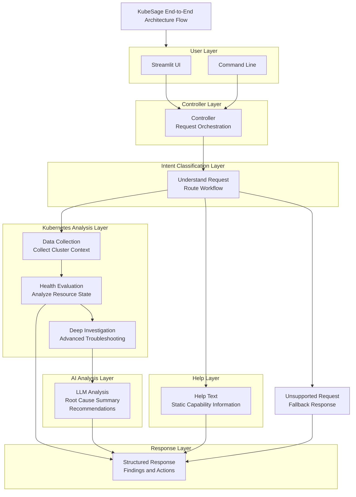

## KubeSage End-to-End Architecture Flow

```mermaid
flowchart TD

    Title["KubeSage End-to-End Architecture Flow"]

    subgraph USER["User Layer"]
        UI["Streamlit UI"]
        CLI["Command Line"]
    end

    subgraph CONTROLLER_LAYER["Controller Layer"]
        Controller["Controller<br/>Request Orchestration"]
    end

    subgraph INTENT_LAYER["Intent Classification Layer"]
        Intent["Understand Request<br/>Route Workflow"]
    end

    subgraph KUBE_LAYER["Kubernetes Analysis Layer"]
        Collector["Data Collection<br/>Collect Cluster Context"]
        Health["Health Evaluation<br/>Analyze Resource State"]
        Investigator["Deep Investigation<br/>Advanced Troubleshooting"]
    end

    subgraph AI_LAYER["AI Analysis Layer"]
        LLM["LLM Analysis<br/>Root Cause Summary<br/>Recommendations"]
    end

    subgraph HELP_LAYER["Help Layer"]
        Help["Help Text<br/>Static Capability Information"]
    end

    subgraph RESPONSE_LAYER["Response Layer"]
        Response["Structured Response<br/>Findings and Actions"]
    end


    Title --> USER

    UI --> Controller
    CLI --> Controller

    Controller --> Intent

    Intent --> Collector
    Collector --> Health
    Health --> Response

    Health --> Investigator
    Investigator --> LLM
    LLM --> Response

    Intent --> Help
    Help --> Response

    Intent --> Unsupported["Unsupported Request<br/>Fallback Response"]
    Unsupported --> Response

```